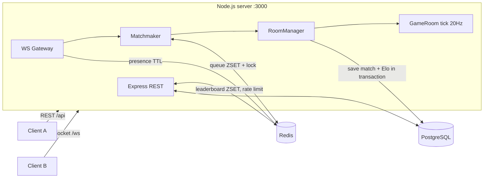

# 🎮 Multiplayer Game Backend — "Coin Rush"

Backend สำหรับเกม Multiplayer แบบ Real-time: ผู้เล่นเข้าคิว → ระบบจับคู่ตาม Rating → เล่นเก็บเหรียญแข่งกันใน room เดียวกัน → จบเกมคำนวณ Elo ใหม่ → อัปเดต Leaderboard

**Stack:** TypeScript · Node.js · Express (REST) · WebSocket (`ws`) · PostgreSQL · Redis · Docker · GitHub Actions · (พร้อม deploy AWS)

---

## ✨ Features

| หมวด | สิ่งที่ทำ |
|---|---|
| **Auth** | Register / Login, bcrypt, **JWT access token (15 นาที) + refresh token แบบ rotation ใน Redis**, logout, rate limit กัน brute-force |
| **Account** | `PUT` แก้ชื่อ/รหัสผ่าน (เปลี่ยนรหัสแล้ว logout ทุกเครื่อง), `DELETE` ลบบัญชี (FK `ON DELETE CASCADE` + ล้าง Redis) |
| **Stats** | SQL `GROUP BY` / `HAVING` / `FILTER`: แมตช์ต่อวัน, win rate |
| **Real-time** | WebSocket แบบ authenticate ก่อน upgrade, heartbeat ping/pong ตัด connection ที่ตาย, 1 connection ต่อ 1 ผู้เล่น |
| **Game loop** | **Server-authoritative** tick 20 ครั้ง/วินาที — client ส่งแค่ "ทิศทาง" server คำนวณตำแหน่ง/ชน/คะแนนเอง (กันโกง) |
| **Anti-cheat** | Validate ทุก message ด้วย zod, normalize vector กัน speed hack, ทิ้ง packet ที่ seq เก่า, token-bucket rate limit ต่อ socket, จำกัด payload 1KB |
| **Matchmaking** | คิวใน Redis Sorted Set, จับคู่ตาม rating ที่ใกล้กัน และขยายช่วง rating ตามเวลารอ, Lua script ดึงผู้เล่นออกจากคิวแบบ atomic, distributed lock (`SET NX PX`) |
| **Reconnect** | หลุดกลางเกมแล้วต่อกลับมาได้ คะแนนยังอยู่ |
| **Persistence** | บันทึกผลแมตช์ใน PostgreSQL แบบ **transaction** + `SELECT ... FOR UPDATE` กัน race condition ตอนอัปเดต rating |
| **Leaderboard** | Redis Sorted Set (อ่านเร็ว O(log N)), Postgres เป็น source of truth และ sync กลับตอน start |
| **Ops** | `/health` เช็ค DB + Redis, structured JSON log, graceful shutdown (จบแมตช์ที่ค้างและบันทึกผลก่อนปิด), Docker multi-stage + non-root |
| **Quality** | Unit test 19 เคส (Vitest), CI ด้วย GitHub Actions, bot script สำหรับ demo/load test |

---

## 🏗️ Architecture



**ลำดับการเล่น 1 เกม**

```
Client                          Server                         Redis / Postgres
  | POST /api/auth/login  ------>  | verify bcrypt                -> players
  | <------ { token }              |
  | WS /ws?token=JWT  ---------->  | verify JWT ก่อน upgrade
  | <------ welcome                |                               -> SET online:{id} EX 30
  | queue_join  --------------->   | ZADD mm:queue rating id      -> Redis
  |                                | (ทุก 1s) lock → findGroups → Lua claim
  | <------ match_found            | new GameRoom().start()
  | input {seq,dx,dy} x N  ---->   | tick: move → collide → score
  | <------ state (20/s)           |
  |                                | หมดเวลา → Elo → BEGIN..COMMIT -> Postgres
  | <------ match_end + rating     |           ZADD leaderboard   -> Redis
```

## 📁 Project structure

```
src/
├── index.ts                 # bootstrap, migrations, graceful shutdown
├── config/env.ts            # env validation (zod) — fail fast ถ้า config ผิด
├── db/
│   ├── postgres.ts          # pool, withTransaction(), migration runner
│   └── redis.ts             # client + รวม key ทั้งหมดไว้ที่เดียว
├── http/
│   ├── app.ts               # express app, /health
│   ├── middleware.ts        # requireAuth, validateBody, rateLimit, errorHandler
│   ├── routes/              # URL → middleware → controller (wiring เท่านั้น)
│   └── controllers/         # ตรวจ input → เรียก service → ส่ง response
├── ws/gameSocket.ts         # WS gateway: auth, heartbeat, message router
├── game/
│   ├── types.ts             # protocol (client↔server messages)
│   ├── GameRoom.ts          # game loop (logic ล้วน — test ได้โดยไม่ต้องมี DB)
│   ├── RoomManager.ts       # จัดการ room, reconnect, จบเกม
│   ├── Matchmaker.ts        # คิวใน Redis + lock + Lua
│   └── matching.ts          # อัลกอริทึมจับคู่ (pure function)
└── services/
    ├── auth.service.ts      # register/login/JWT
    ├── player.service.ts    # profile, leaderboard, history, update/delete account, saveMatchResult
    ├── stats.service.ts     # GROUP BY queries
    ├── elo.ts               # Elo rating (pure function)
    └── rateLimit.service.ts
migrations/001_init.sql, 002_player_delete.sql
public/index.html            # browser test client (canvas)
scripts/bot.ts               # bot เล่นเอง ใช้ demo / load test
```

---

## 🚀 Getting started

### วิธีที่ 1 — Docker (ง่ายสุด)

```bash
docker compose up --build
```

เปิด http://localhost:3000 สองแท็บ → register คนละ user → กด **Find match** → เดินด้วย WASD

### วิธีที่ 2 — รันเอง (dev mode)

```bash
docker compose up -d postgres redis   # หรือใช้ของที่ติดตั้งไว้
cp .env.example .env
npm install
npm run dev
```

### ให้ bot เล่นกันเอง

```bash
npm run bot            # 2 bots → 1 แมตช์
BOTS=10 npm run bot    # 10 bots → 5 แมตช์พร้อมกัน
```

ผลที่ได้ (ตัวอย่างจริง, MATCH_DURATION_SEC=10):

```
[bot_3] match 5c85b3f3 vs [ 'bot_2', 'bot_3' ]
[bot_2] match over — score 8, rating 1000 → 984
[bot_3] match over — score 9, rating 1000 → 1016 🏆 WIN
```

### Tests

```bash
npm test          # 19 unit tests: GameRoom, matching, Elo
npm run typecheck
npm run test:api  # ยิง REST API ทุกตัว (ต้องเปิด server ไว้)
```

---

## 📡 REST API

| Method | Path | Auth | คำอธิบาย |
|---|---|---|---|
| GET | `/health` | – | สถานะ Postgres/Redis, ผู้เล่นออนไลน์, room ที่กำลังเล่น |
| POST | `/api/auth/register` | – | `{username, password}` → `{player, token, refreshToken}` |
| POST | `/api/auth/login` | – | `{username, password}` → `{player, token, refreshToken}` |
| POST | `/api/auth/refresh` | – | `{refreshToken}` → token คู่ใหม่ (ตัวเก่าใช้ซ้ำไม่ได้) |
| POST | `/api/auth/logout` | – | `{refreshToken}` → 204 |
| PUT | `/api/players/me` | Bearer | `{username?, password?}` แก้ข้อมูลตัวเอง |
| DELETE | `/api/players/me` | Bearer | ลบบัญชีตัวเอง → 204 |
| GET | `/api/stats/daily?days=7` | – | จำนวนแมตช์ / ผู้เล่น / คะแนนเฉลี่ย ต่อวัน (GROUP BY) |
| GET | `/api/stats/top-winners` | – | ผู้ชนะมากที่สุด + win rate (JOIN + GROUP BY + HAVING) |
| GET | `/api/players/me` | Bearer | โปรไฟล์ + rank |
| GET | `/api/players/me/matches?limit=20` | Bearer | ประวัติการแข่ง |
| GET | `/api/players/:id` | – | โปรไฟล์ผู้เล่นอื่น |
| GET | `/api/leaderboard?limit=10&offset=0` | – | อันดับ rating |

Error format เดียวกันทั้งระบบ:

```json
{ "error": { "code": "VALIDATION_ERROR", "message": "Invalid request", "details": { "password": ["..."] } } }
```

## 🔌 WebSocket protocol

เชื่อมต่อ: `ws://localhost:3000/ws?token=<JWT>` (token ผิด → `401` ก่อน upgrade)

**Client → Server**

```jsonc
{ "type": "queue_join" }
{ "type": "queue_leave" }
{ "type": "input", "seq": 42, "dx": 1, "dy": 0 }   // dx,dy ∈ [-1, 1]
{ "type": "ping", "t": 1727668800000 }
```

**Server → Client**

```jsonc
{ "type": "welcome", "playerId": "...", "username": "alice" }
{ "type": "queue_joined", "position": 3 }
{ "type": "match_found", "matchId": "...", "players": [...], "map": {"width":800,"height":600}, "durationSec": 60, "tickRate": 20 }
{ "type": "state", "tick": 120, "timeLeftMs": 54000, "lastProcessedSeq": 42, "players": [...], "coins": [...] }
{ "type": "match_end", "matchId": "...", "winnerId": "...", "results": [{ "playerId": "...", "score": 9, "ratingBefore": 1000, "ratingAfter": 1016 }] }
{ "type": "pong", "t": 1727668800000, "serverTime": 1727668800012 }
{ "type": "error", "code": "RATE_LIMITED", "message": "..." }
```

`lastProcessedSeq` ใช้ทำ client-side prediction / reconciliation ได้

## 🗄️ Database schema

```
players        (id, username UNIQUE, password_hash, rating, games_played, wins, created_at)
matches        (id, started_at, ended_at, winner_id → players)
match_players  (match_id, player_id, score, rating_before, rating_after)  PK(match_id, player_id)
```

Redis keys: `leaderboard:rating` (ZSET) · `mm:queue` (ZSET) · `mm:joined_at` (HASH) · `mm:lock` · `online:{id}` (TTL) · `rl:{bucket}:{ip}`

---

## ☁️ Deploy บน AWS (แนวทาง)

| ส่วน | AWS service |
|---|---|
| Container image | **ECR** (`docker build` → `docker push`) |
| รัน API | **ECS Fargate** (หรือ EC2 + docker compose สำหรับงบน้อย) |
| Load balancer | **ALB** — รองรับ WebSocket, เปิด **sticky session** และตั้ง idle timeout ≥ 60s |
| Database | **RDS PostgreSQL** |
| Cache/Queue | **ElastiCache Redis** |
| Secrets | **Secrets Manager / SSM** เก็บ `JWT_SECRET`, `DATABASE_URL` |
| Logs | **CloudWatch Logs** (log เป็น JSON อยู่แล้ว query ง่าย) |
| Health check | ALB target group → `GET /health` |

---

## 📈 Scaling & ข้อจำกัดที่รู้อยู่ (พูดตอนสัมภาษณ์ได้)

- **ตอนนี้:** REST, leaderboard, rate limit, คิว matchmaking และ lock อยู่ใน Redis → รันหลาย instance ได้ แต่ **GameRoom อยู่ใน memory ของ instance เดียว** ผู้เล่นใน room เดียวกันจึงต้องต่อเข้า instance เดียวกัน
- **Scale ต่อ:** เก็บ `room:{id} → serverId/address` ใน Redis, ตอน `match_found` ส่ง URL ของ game server ที่ host room ให้ client ต่อไปที่นั่น (แยก *lobby service* กับ *game server* แบบเกมจริง) หรือใช้ Redis Pub/Sub ส่ง event ข้าม instance
- **Bandwidth:** ส่ง full snapshot ทุก tick — ถ้าผู้เล่นเยอะควรเปลี่ยนเป็น delta compression / binary (MessagePack)
- **Client:** ยังไม่มี interpolation / prediction ฝั่ง client (server ส่ง `lastProcessedSeq` ไว้ให้แล้ว)

## 🎯 สิ่งที่โปรเจกต์นี้แสดงให้เห็น (สำหรับตำแหน่ง Junior Backend)

1. **ออกแบบ REST API** ที่มี validation, error format สม่ำเสมอ, auth ด้วย JWT
2. **WebSocket real-time** รวมถึงเรื่องที่มักถูกถาม: heartbeat, reconnect, rate limit, auth ตอน handshake
3. **Game server แบบ authoritative** และเหตุผลว่าทำไมห้ามเชื่อ client
4. **ใช้ Redis ถูกงาน:** sorted set, TTL, atomic Lua, distributed lock, rate limiter
5. **PostgreSQL:** schema + index, transaction, row lock กัน race condition
6. **แยก logic ออกจาก I/O** (`GameRoom`, `elo`, `matching` เป็น pure) → เขียน unit test ได้ง่าย
7. **DevOps พื้นฐาน:** Docker multi-stage, compose, health check, CI, graceful shutdown, แนวทาง AWS
